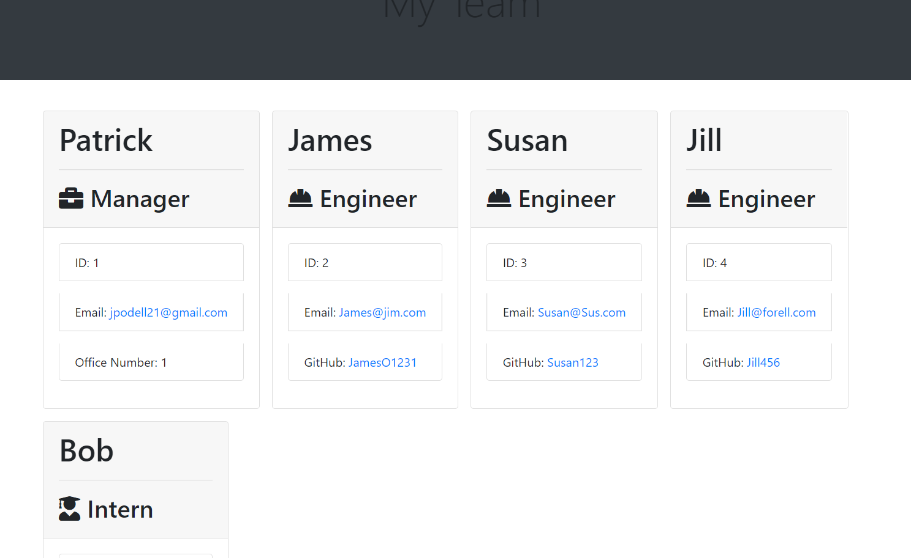

# Team Profile Generator

## Project Description
* This is a Node.js command-line application that takes in information about employees on a software engineering team, then generates an HTML webpage that displays summaries for each person.

## Installations
* Inquirer
* Jest
* fs
* open

## Usage Information
* This application will allow you to build your team profiles dynamically through a command-line application that will then generate a HTML page for you based on you entery.

## Contributor Guidelines
* Contribution rules are under the Code of Conduct section

## Code of Conduct
* [Contributor Code of Conduct](https://www.contributor-covenant.org/version/2/0/code_of_conduct/code_of_conduct.md)

## Test Instructions
* This app has test.js for all of your employee levels. Starting with your manager functions to your Intern functions. That way you can make sure that your functions are all working the way they are supposed to be.

## Questions
* For additional help or questions about collaboration, please reach out to jpodell21@gmail.com
* Follow me on Github at [JamesO1231](http://github.com/JamesO1231)

## Video Tutorial
* [Video Tutorial Link](https://drive.google.com/file/d/13QsOAPvI8x8axT30bau9UpkQcnsJqPuY/view?usp=sharing)

## Deployment Image
